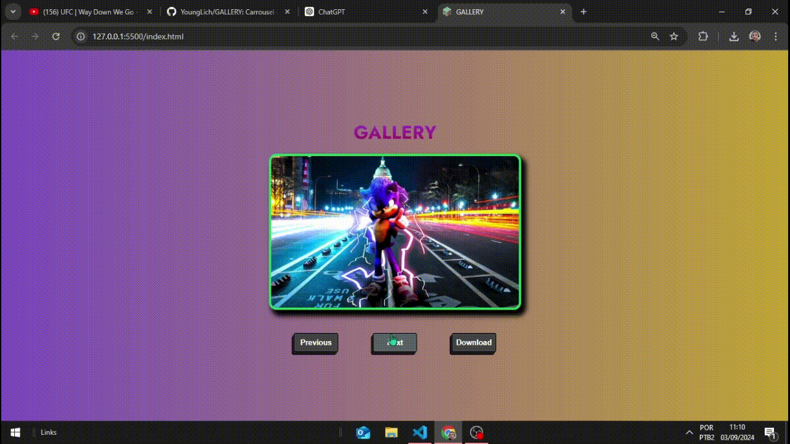

  <h1>🖼️ Carrossel de Wallpapers com HTML, CSS e JavaScript</h1>
  <h4>Projeto de galeria interativa com mais de 40 wallpapers para Desktop e Mobile 📱💻</h4>
  

  

## 📂 Sobre o Projeto

Este é um projeto de carrossel de imagens desenvolvido com HTML, CSS e JavaScript. Ele exibe uma galeria animada com efeitos de flip entre imagens, simulando molduras realistas de celular e desktop. 

Todas as imagens (wallpapers) são organizadas por meio de um arquivo JSON, que armazena os caminhos dos arquivos, facilitando a manutenção e futuras atualizações.

---

## 🧱 Tecnologias Utilizadas

- **HTML5** – estrutura da página
- **CSS3** – animações, responsividade e estilização geral
- **JavaScript Vanilla** – lógica de navegação e carregamento dinâmico de imagens
- **JSON** – usado como base de dados para os caminhos dos wallpapers

---

## 🖼️ Funcionalidades

- 🔁 Navegação entre wallpapers com efeito de flip 3D
- 🧠 Carregamento dinâmico das imagens a partir de um JSON
- 🖥️ Molduras realistas para dispositivos Desktop e Mobile
- 🎨 Mais de **40 wallpapers exclusivos**
- ⚡ Totalmente responsivo

---

## 🗂️ Organização dos Arquivos

